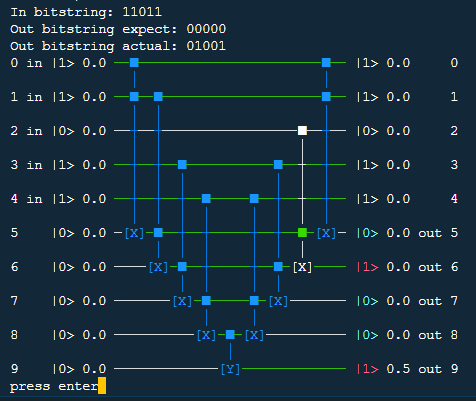

# quantestpy.assert_circuit_equivalent_to_output_qubit_state

## assert_circuit_equivalent_to_output_qubit_state(circuit, input_reg, output_reg, input_to_output, draw_circuit=False)

Raises a QuantestPyAssertionError if a qubit value (and optionally a qubit phase) in final state does not agree with an user's expectation.

### Parameters

#### circuit : \{quantestpy.QuantestPyCircuit, qiskit.QuantumCircuit, OpenQASM 2.0 string\}
The circuit to test. [quantestpy.QuantestPyCircuit](../simulator/quantestpy_circuit.md) is a circuit class developed in this project.

#### input_reg : list[int]
A list of input qubit ids. The length of this list must coincide with that of the keys in `input_to_output`.

#### output_reg : list[int]
A list of output qubit ids. The length of this list must coincide with that of the values in `input_to_output`.

#### input_to_output : dict
The key of this dictionary is a binary bitstring representing the initial state value for the qubits in `input_reg`. The length of this string must coincide with that of `input_reg`.

The value of this dictionary is either a binary bitstring representing the expected final state value for the qubits in `output_reg` or a tuple whose first element is the same binary bitstring and second element is a list of the expected qubit phases in unit of \pi. The length of the bitstring and that of the list must coincide with that of `output_reg`.

#### draw_circuit : bool, optional
If True, prints out the circuit instead of raising a QuantestPyAssertionError when the assertion error occurred.

### Examples
```py
from quantestpy import QuantestPyCircuit, assert_circuit_equivalent_to_output_qubit_state
qc = QuantestPyCircuit(10)
qc.add_gate({"name": "x", "target_qubit": [5], "control_qubit": [0, 1], "control_value": [1, 1]})
qc.add_gate({"name": "x", "target_qubit": [6], "control_qubit": [1, 5], "control_value": [1, 1]})  # error
qc.add_gate({"name": "x", "target_qubit": [7], "control_qubit": [3, 6], "control_value": [1, 1]})
qc.add_gate({"name": "x", "target_qubit": [8], "control_qubit": [4, 7], "control_value": [1, 1]})
qc.add_gate({"name": "y", "target_qubit": [9], "control_qubit": [8], "control_value": [1]})
qc.add_gate({"name": "x", "target_qubit": [8], "control_qubit": [4, 7], "control_value": [1, 1]})
qc.add_gate({"name": "x", "target_qubit": [7], "control_qubit": [3, 6], "control_value": [1, 1]})
qc.add_gate({"name": "x", "target_qubit": [6], "control_qubit": [2, 5], "control_value": [1, 1]})
qc.add_gate({"name": "x", "target_qubit": [5], "control_qubit": [0, 1], "control_value": [1, 1]})
```
The above circuit is constructed with an error on purpose.
Use the assert method to check the consistency:
```py
assert_circuit_equivalent_to_output_qubit_state(
    circuit=qc,
    input_reg=[0, 1, 2, 3, 4],
    output_reg=[5, 6, 7, 8, 9],
    input_to_output={
        "00000": "00000",
        "11011": "00000",
        "11111": ("00001", [0, 0, 0, 0, 0.5])
    }
)
...
QuantestPyAssertionError: In bitstring: 11011
Out bitstring expect: 00000
Out bitstring actual: 01001
```
Using the `draw_circuit` option:
```py
assert_circuit_equivalent_to_output_qubit_state(
    circuit=qc,
    input_reg=[0, 1, 2, 3, 4],
    output_reg=[5, 6, 7, 8, 9],
    input_to_output={
        "00000": "00000",
        "11011": "00000",
        "11111": ("00001", [0, 0, 0, 0, 0.5])
    },
    draw_circuit=True
)
```

