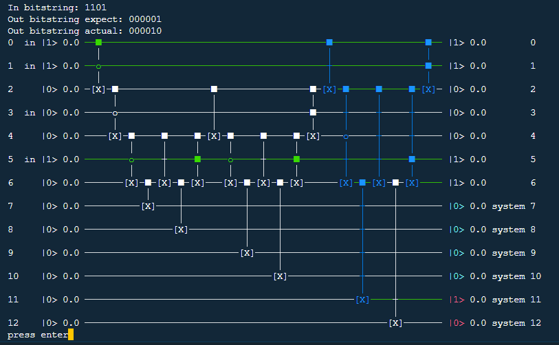

# quantestpy.assert_unary_iteration

## assert_unary_iteration(circuit, index_reg, system_reg, input_to_output, ancilla_reg=[], draw_circuit=False)

This is an assert method for testing indexed operation circuits such as unary iteration circuits. This method raises a QuantestPyAssertionError if a qubit value in a system register after replacing all the gates in the system register by X-gates does not agree with an user's expectation for a given qubit value in a index register.

### Parameters

#### circuit : \{quantestpy.QuantestPyCircuit, qiskit.QuantumCircuit, OpenQASM 2.0 string\}
The circuit to test. [quantestpy.QuantestPyCircuit](../simulator/quantestpy_circuit.md) is a circuit class developed in this project.

#### index_reg : list[int]
A list of qubit ids in the index register. The length of this list must coincide with that of the keys in `input_to_output`.

#### system_reg : list[int]
A list of qubit ids in the system register. The length of this list must coincide with that of the values in `input_to_output`.

#### input_to_output : dict
The key of this dictionary is a binary bitstring representing the initial state value for the qubits in `index_reg`. The length of this string must coincide with that of `index_reg`.

The value of this dictionary is a binary bitstring representing the expected final state value for the qubits in `system_reg` after replacing all the gates in the system register by X-gates. The length of the bitstring must coincide with that of `system_reg`.

#### ancilla_reg : list[int], optional
A list of ancilla qubit ids. If given, the assert method checks that the ancilla qubits are initialized to 0 at the end of the circuit.

#### draw_circuit : bool, optional
If True, prints out the circuit instead of raising a QuantestPyAssertionError when the assertion error occurred.

### Examples
The following circuit is an L=6 unary iteration circuit, which is a variant of the circuit in Figure 7 in [arXiv:1805.03662](https://arxiv.org/abs/1805.03662):
```py
from quantestpy import QuantestPyCircuit, assert_unary_iteration
qc = QuantestPyCircuit(13)
qc.add_gate({"name": "x", "control_qubit": [0, 1], "target_qubit": [2], "control_value": [1, 0]})
qc.add_gate({"name": "x", "control_qubit": [2, 3], "target_qubit": [4], "control_value": [1, 0]})
qc.add_gate({"name": "x", "control_qubit": [4, 5], "target_qubit": [6], "control_value": [1, 0]})
qc.add_gate({"name": "y", "control_qubit": [6], "target_qubit": [7], "control_value": [1]})
qc.add_gate({"name": "x", "control_qubit": [4], "target_qubit": [6], "control_value": [1]})
qc.add_gate({"name": "y", "control_qubit": [6], "target_qubit": [8], "control_value": [1]})
qc.add_gate({"name": "x", "control_qubit": [4, 5], "target_qubit": [6], "control_value": [1, 1]})
qc.add_gate({"name": "x", "control_qubit": [2], "target_qubit": [4], "control_value": [1]})
qc.add_gate({"name": "x", "control_qubit": [4, 5], "target_qubit": [6], "control_value": [1, 0]})
qc.add_gate({"name": "y", "control_qubit": [6], "target_qubit": [9], "control_value": [1]})
qc.add_gate({"name": "x", "control_qubit": [4], "target_qubit": [6], "control_value": [1]})
qc.add_gate({"name": "y", "control_qubit": [6], "target_qubit": [10], "control_value": [1]})
qc.add_gate({"name": "x", "control_qubit": [4, 5], "target_qubit": [6], "control_value": [1, 1]})
qc.add_gate({"name": "x", "control_qubit": [2, 3], "target_qubit": [4], "control_value": [1, 1]})
qc.add_gate({"name": "x", "control_qubit": [0], "target_qubit": [2], "control_value": [1]})
qc.add_gate({"name": "x", "control_qubit": [2, 4], "target_qubit": [6], "control_value": [1, 0]})  # error
qc.add_gate({"name": "y", "control_qubit": [6], "target_qubit": [11], "control_value": [1]})
qc.add_gate({"name": "x", "control_qubit": [2], "target_qubit": [6], "control_value": [1]})
qc.add_gate({"name": "y", "control_qubit": [6], "target_qubit": [12], "control_value": [1]})
qc.add_gate({"name": "x", "control_qubit": [2, 5], "target_qubit": [6], "control_value": [1, 1]})
qc.add_gate({"name": "x", "control_qubit": [0, 1], "target_qubit": [2], "control_value": [1, 1]})
```
The above circuit is constructed with an error on purpose.
Use the assert method to check the consistency:
```py
assert_unary_iteration(
    circuit=qc,
    index_reg=[0, 1, 3, 5],
    system_reg=[7, 8, 9, 10, 11, 12],
    input_to_output={
        "1000": "100000",
        "1001": "010000",
        "1010": "001000",
        "1011": "000100",
        "1100": "000010",
        "1101": "000001"
    }
)
...
QuantestPyAssertionError: In bitstring: 1101
Out bitstring expect: 000001
Out bitstring actual: 000010
```
Using the `draw_circuit` option:
```py
assert_unary_iteration(
    circuit=qc,
    index_reg=[0, 1, 3, 5],
    system_reg=[7, 8, 9, 10, 11, 12],
    input_to_output={
        "1000": "100000",
        "1001": "010000",
        "1010": "001000",
        "1011": "000100",
        "1100": "000010",
        "1101": "000001"
    },
    draw_circuit=True
)
```

