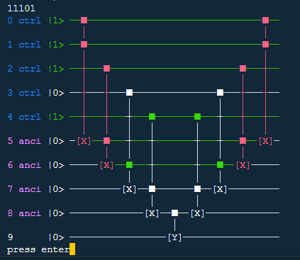
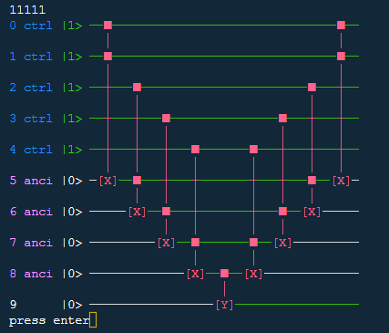

# quantestpy.assert_color_ctrl_val

## assert_color_ctrl_val(circuit, ctrl_reg, ancilla_reg=[], val_in_ctrl_reg_list=[])

Prints out in stdout the colored circuit for all or optionally chosen initial qubit values in `ctrl_reg`. Qubits in a state `|1>` are green-colored and the executed gates are red-colored.

### Parameters

#### circuit: quantestpy.PauliCircuit
The circuit to draw. [quantestpy.PauliCircuit](./pauli_circuit.md) is a circuit class developed in this project.

#### ctrl_reg : list[int]
A list of qubit ids. The output of this method is the circuit(s) from all or optionally selected initial state(s) for these qubits.

#### ancilla_reg : list[int], optional
A list of qubit ids. These qubits are internally set 0 in the initial states.

#### val_in_ctrl_reg_list : list[str], optional
A list of initial values for the qubit(s) in `ctrl_reg`. If not given, all possible values are covered.

### Examples

```py
from quantestpy import PauliCircuit, assert_color_ctrl_val

pc = PauliCircuit(10)
pc.add_gate({"name": "x", "target_qubit": [5], "control_qubit": [0, 1], "control_value": [1, 1]})
pc.add_gate({"name": "x", "target_qubit": [6], "control_qubit": [2, 5], "control_value": [1, 1]})
pc.add_gate({"name": "x", "target_qubit": [7], "control_qubit": [3, 6], "control_value": [1, 1]})
pc.add_gate({"name": "x", "target_qubit": [8], "control_qubit": [4, 7], "control_value": [1, 1]})
pc.add_gate({"name": "y", "target_qubit": [9], "control_qubit": [8], "control_value": [1]})
pc.add_gate({"name": "x", "target_qubit": [8], "control_qubit": [4, 7], "control_value": [1, 1]})
pc.add_gate({"name": "x", "target_qubit": [7], "control_qubit": [3, 6], "control_value": [1, 1]})
pc.add_gate({"name": "x", "target_qubit": [6], "control_qubit": [2, 5], "control_value": [1, 1]})
pc.add_gate({"name": "x", "target_qubit": [5], "control_qubit": [0, 1], "control_value": [1, 1]})

assert_color_ctrl_val(
    circuit=pc,
    ctrl_reg=[0, 1, 2, 3, 4],
    ancilla_reg=[5, 6, 7, 8],
    val_in_ctrl_reg_list=["11101", "11111"]
)
```



