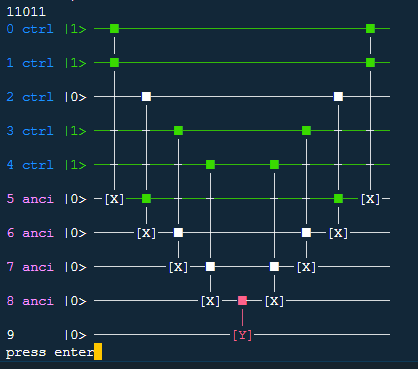

# quantestpy.assert_equal_ctrl_val

## assert_equal_ctrl_val(circuit, ctrl_reg, val_in_ctrl_reg_to_is_gate_executed_expect, ancilla_reg=[], tgt_reg=[], draw_circuit=False, check_ancilla_is_uncomputed=False)
Raises a QuantestPyAssertionError if an user's expectation of whether a gate is executed or not does not agree with the actual result.

Optionally, prints out in stdout the colored circuit in which the gate disagreed is highlighted by red color.

### Parameters

#### circuit: quantestpy.PauliCircuit
The circuit to test. [quantestpy.PauliCircuit](./pauli_circuit.md) is a circuit class developed in this project.

#### ctrl_reg : list[int]
A list of qubit ids. The length of this list must coincide with that of the key in `val_in_ctrl_reg_to_is_gate_executed_expect`.

#### val_in_ctrl_reg_to_is_gate_executed_expect : dict
The key of this dictionary is a string representing the initial state for the qubits in `ctrl_reg`. The length of this string must coincide with that of `ctrl_reg`.

The value of this dictionary is a list containing integers of either `0` or `1`, where `1` expects that a gate whose target qubit is in `tgt_reg` is executed while `0` expects that the gate is not executed. The length of the list must coincide with the number of gates whose target qubit is in `tgt_reg`.

#### ancilla_reg : list[int], optional
A list of qubit ids. These qubits are internally set 0 in the initial states.

#### tgt_reg : list[int], optional
A list of qubit ids. The gates whose target qubit is in this list are subject to the test.
If not given, all the qubits but `ctrl_reg` and `ancilla_reg` are assigned to `tgt_reg`.

#### draw_circuit : bool, optional
If True, prints out the circuit instead of raising a QuantestPyAssertionError when the assertion error happened.

#### check_ancilla_is_uncomputed : bool, optional
If True, raises a QuantestPyAssertionError if the qubits in `ancilla_reg` are not back to 0 by uncomputation.

### Examples

Build a circuit:
```py
from quantestpy import PauliCircuit, assert_equal_ctrl_val

pc = PauliCircuit(10)
pc.add_gate({"name": "x", "target_qubit": [5], "control_qubit": [0, 1], "control_value": [1, 1]})
pc.add_gate({"name": "x", "target_qubit": [6], "control_qubit": [2, 5], "control_value": [1, 1]})
pc.add_gate({"name": "x", "target_qubit": [7], "control_qubit": [3, 6], "control_value": [1, 1]})
pc.add_gate({"name": "x", "target_qubit": [8], "control_qubit": [4, 7], "control_value": [1, 1]})
pc.add_gate({"name": "y", "target_qubit": [9], "control_qubit": [8], "control_value": [1]})
pc.add_gate({"name": "x", "target_qubit": [8], "control_qubit": [4, 7], "control_value": [1, 1]})
pc.add_gate({"name": "x", "target_qubit": [7], "control_qubit": [3, 6], "control_value": [1, 1]})
pc.add_gate({"name": "x", "target_qubit": [6], "control_qubit": [2, 5], "control_value": [1, 1]})
pc.add_gate({"name": "x", "target_qubit": [5], "control_qubit": [0, 1], "control_value": [1, 1]})
```
Use the assert method to check the consistency:
```py
assert_equal_ctrl_val(
    circuit=pc,
    ctrl_reg=[0, 1, 2, 3, 4],
    ancilla_reg=[5, 6, 7, 8],
    tgt_reg=[9],
    val_in_ctrl_reg_to_is_gate_executed_expect={
        "00000": [0],
        "11011": [1]
    }
)
...
QuantestPyAssertionError: val_in_ctrl_reg: 11011
is_gate_executed_expect: [1]
is_gate_executed_actual: [0]
```
Using the `draw_circuit` option:
```py
assert_equal_ctrl_val(
    circuit=pc,
    ctrl_reg=[0, 1, 2, 3, 4],
    ancilla_reg=[5, 6, 7, 8],
    tgt_reg=[9],
    val_in_ctrl_reg_to_is_gate_executed_expect={
        "00000": [0],
        "11011": [1]
    },
    draw_circuit=True
)
```

